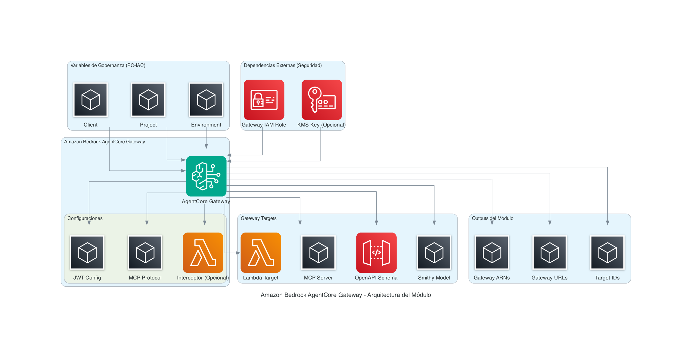

# Amazon Bedrock AgentCore Gateway - Documentación de IaC

## Descripción

El módulo **Amazon Bedrock AgentCore Gateway** es una solución de infraestructura como código (IaC) que automatiza la creación y gestión de gateways de Amazon Bedrock AgentCore con sus targets asociados. Este servicio completamente administrado simplifica el proceso de construcción, despliegue, descubrimiento y conexión de herramientas y otros recursos a agentes de IA a escala.

El módulo permite a los desarrolladores convertir APIs, funciones Lambda y servicios existentes en herramientas compatibles con el Protocolo de Contexto de Modelo (MCP), proporcionando una interfaz unificada para la integración de agentes de IA con sistemas empresariales.

## Diagrama de Arquitectura



La arquitectura del módulo se organiza en las siguientes capas:

1. **Variables de Gobernanza**: Entrada de parámetros de nomenclatura y etiquetado
2. **Dependencias Externas**: Recursos de seguridad gestionados externamente
3. **Gateway Principal**: Recurso central de Bedrock AgentCore
4. **Configuraciones**: Componentes de autorización, protocolo e interceptores
5. **Targets**: Diferentes tipos de destinos (Lambda, MCP Server, OpenAPI, Smithy)
6. **Outputs**: Información de salida para integración con otros módulos

## Características

### Seguridad por Defecto
- **Cifrado en Reposo**: Habilitado por defecto con soporte para claves KMS gestionadas por el cliente
- **Autorización Flexible**: Soporte completo para JWT personalizado y autorización IAM de AWS
- **Principio de Mínimo Privilegio**: Roles IAM proporcionados externamente desde el dominio de Seguridad
- **Protección de Recursos**: `prevent_destroy = true` para evitar eliminación accidental

### Múltiples Tipos de Target
- **Lambda Functions**: Integración directa con funciones AWS Lambda
- **OpenAPI Schemas**: Soporte para especificaciones OpenAPI inline o desde S3
- **Smithy Models**: Integración con modelos Smithy para definición de servicios
- **MCP Servers**: Conexión directa con servidores del Protocolo de Contexto de Modelo

### Capacidades Avanzadas
- **Interceptores**: Ejecución de código personalizado durante cada invocación (REQUEST/RESPONSE)
- **Búsqueda Semántica**: Búsqueda inteligente de herramientas usando consultas en lenguaje natural
- **Esquemas Complejos**: Soporte para esquemas inline y almacenados en S3 con serialización JSON
- **Workload Identity**: Exposición automática de identidades de workload para integración

### Cumplimiento PC-IAC
Implementación completa de las 23 reglas de gobernanza PC-IAC, incluyendo:
- Estructura de módulo estándar con 10 archivos obligatorios
- Variables tipificadas con validaciones exhaustivas
- Nomenclatura estándar y etiquetado consistente
- Uso de `for_each` para estabilidad y `prevent_destroy` para protección

## Estructura del Módulo

```
cloudops-ref-repo-aws-bedrock-agentcore-gateway-terraform/
├── main.tf                 # Recursos principales del módulo
├── variables.tf            # Variables de entrada con validaciones
├── outputs.tf              # Outputs del módulo con Splat Expressions
├── locals.tf               # Transformaciones y valores locales
├── data.tf                 # Data sources para información externa
├── providers.tf            # Configuración de providers con alias
├── versions.tf             # Versiones de Terraform y providers
├── README.md               # Documentación principal del módulo
├── CHANGELOG.md            # Historial de cambios y versiones
├── .gitignore              # Archivos excluidos del control de versiones
└── sample/                 # Directorio con ejemplo de implementación
    ├── main.tf             # Invocación del módulo con configuración completa
    ├── variables.tf        # Variables del ejemplo
    ├── outputs.tf          # Outputs del ejemplo
    ├── data.tf             # Data sources del ejemplo
    ├── providers.tf        # Configuración de providers del ejemplo
    ├── terraform.tfvars    # Valores de ejemplo para variables
    └── README.md           # Documentación del ejemplo
```

## Implementación y Configuración

### Requisitos Previos

- **Terraform**: >= 1.0.0
- **AWS Provider**: >= 4.31.0
- **Rol IAM**: Con permisos para Bedrock AgentCore (proporcionado externamente)
- **Clave KMS**: Opcional, para cifrado personalizado (proporcionada externamente)
- **Funciones Lambda**: Deben existir previamente para targets Lambda

### Configuración Básica

```hcl
module "bedrock_agentcore_gateway" {
  source = "git::https://repo-url/bedrock-agentcore-gateway-module.git?ref=v1.0.0"

  providers = {
    aws.project = aws.principal
  }

  # Variables de Gobernanza (PC-IAC-003)
  client      = "empresa"
  project     = "ai-platform"
  environment = "pdn"

  # Configuración del Gateway
  gateways = {
    main = {
      description       = "Gateway principal para agentes AI"
      authorizer_type   = "CUSTOM_JWT"
      protocol_type     = "MCP"
      exception_level   = "ERROR"
      enable_encryption = true
      
      jwt_config = {
        discovery_url    = "https://auth.empresa.com/.well-known/openid-configuration"
        allowed_audience = ["ai-agents", "web-client"]
        allowed_clients  = ["client-123", "client-456"]
      }

      protocol_config = {
        instructions       = "Gateway para manejo de solicitudes MCP"
        search_type        = "SEMANTIC"
        supported_versions = ["2025-03-26", "2025-06-18"]
      }

      targets = {
        lambda_processor = {
          type        = "lambda"
          description = "Procesador de solicitudes Lambda"
          lambda_arn  = "arn:aws:lambda:us-east-1:123456789012:function:processor"
          
          credential_provider = {
            type = "gateway_iam_role"
          }

          tool_schema = {
            name        = "process_request"
            description = "Procesa solicitudes entrantes"
            input_schema = {
              type        = "object"
              description = "Esquema de procesamiento de solicitudes"
              properties = [
                {
                  name        = "message"
                  type        = "string"
                  description = "Mensaje a procesar"
                  required    = true
                }
              ]
            }
          }
        }
      }
    }
  }

  # Dependencias externas (PC-IAC-023)
  gateway_role_arn = "arn:aws:iam::123456789012:role/bedrock-agentcore-gateway-role"
  kms_key_arn      = "arn:aws:kms:us-east-1:123456789012:key/12345678-1234-1234-1234-123456789012"
}
```

## Tabla de Parámetros

### Variables de Entrada

| Nombre | Tipo | Requerido | Descripción | Validación |
|--------|------|-----------|-------------|------------|
| `client` | `string` | ✅ | Nombre del cliente/unidad de negocio | 1-10 caracteres |
| `project` | `string` | ✅ | Nombre del proyecto específico | 1-15 caracteres |
| `environment` | `string` | ✅ | Entorno de despliegue | `dev`, `qa`, `pdn`, `prod` |
| `gateways` | `map(object)` | ✅ | Configuración de los gateways | Ver estructura detallada |
| `gateway_role_arn` | `string` | ✅ | ARN del rol IAM para el gateway | Formato ARN válido |
| `kms_key_arn` | `string` | ❌ | ARN de la clave KMS para cifrado | Formato ARN válido |

### Estructura de `gateways`

```hcl
gateways = {
  gateway_key = {
    description       = string                    # Descripción del gateway
    authorizer_type   = string                    # "CUSTOM_JWT" o "AWS_IAM"
    protocol_type     = optional(string, "MCP")  # Tipo de protocolo
    exception_level   = optional(string, "ERROR") # Nivel de excepciones
    enable_encryption = optional(bool, true)     # Habilitar cifrado
    
    # Configuración JWT (requerida para CUSTOM_JWT)
    jwt_config = optional(object({
      discovery_url    = string           # URL de descubrimiento OIDC
      allowed_audience = list(string)     # Audiencias permitidas
      allowed_clients  = list(string)     # Clientes permitidos
    }))
    
    # Configuración del protocolo MCP
    protocol_config = optional(object({
      instructions       = string         # Instrucciones del protocolo
      search_type        = string         # Tipo de búsqueda ("SEMANTIC")
      supported_versions = list(string)   # Versiones soportadas
    }))
    
    # Configuración de interceptores
    interceptor_config = optional(object({
      interception_points   = list(string) # Puntos de intercepción
      lambda_arn           = string        # ARN de Lambda interceptor
      pass_request_headers = bool          # Pasar headers de request
    }))
    
    # Targets del gateway
    targets = map(object({
      type        = string  # "lambda", "openapi", "smithy", "mcp_server"
      description = string  # Descripción del target
      
      # Configuración específica por tipo
      lambda_arn     = optional(string)  # Para targets Lambda
      mcp_endpoint   = optional(string)  # Para MCP servers
      schema_config  = optional(object)  # Para OpenAPI/Smithy
      
      # Proveedor de credenciales
      credential_provider = object({
        type = string  # "gateway_iam_role", "api_key", "oauth"
        # Configuraciones específicas por tipo...
      })
      
      # Esquema de herramienta (para Lambda)
      tool_schema = optional(object({
        name         = string
        description  = string
        input_schema = object  # Esquema de entrada
        output_schema = optional(object)  # Esquema de salida
      }))
      
      additional_tags = optional(map(string), {})
    }))
    
    additional_tags = optional(map(string), {})
  }
}
```

### Variables de Salida

| Nombre | Tipo | Descripción |
|--------|------|-------------|
| `gateway_arns` | `list(string)` | ARNs de los gateways creados |
| `gateway_ids` | `list(string)` | IDs únicos de los gateways |
| `gateway_urls` | `list(string)` | URLs de endpoints de los gateways |
| `gateway_arns_by_key` | `map(string)` | Mapa de ARNs indexados por clave |
| `gateway_ids_by_key` | `map(string)` | Mapa de IDs indexados por clave |
| `gateway_urls_by_key` | `map(string)` | Mapa de URLs indexados por clave |
| `target_ids` | `list(string)` | IDs de los targets creados |
| `target_ids_by_key` | `map(string)` | Mapa de IDs de targets por clave compuesta |
| `workload_identity_arns` | `map(string)` | ARNs de identidades de workload |

## Ejemplos de Uso

### Ejemplo 1: Gateway con Autorización JWT y Target Lambda

```hcl
module "ai_gateway" {
  source = "../"
  
  providers = {
    aws.project = aws.principal
  }
  
  client      = "acme"
  project     = "chatbot"
  environment = "pdn"
  
  gateways = {
    chatbot = {
      description     = "Gateway para chatbot empresarial"
      authorizer_type = "CUSTOM_JWT"
      
      jwt_config = {
        discovery_url    = "https://auth.acme.com/.well-known/openid-configuration"
        allowed_audience = ["chatbot-api"]
        allowed_clients  = ["web-app", "mobile-app"]
      }
      
      targets = {
        nlp_processor = {
          type        = "lambda"
          description = "Procesador de lenguaje natural"
          lambda_arn  = data.aws_lambda_function.nlp.arn
          
          credential_provider = {
            type = "gateway_iam_role"
          }
          
          tool_schema = {
            name        = "process_text"
            description = "Procesa texto con NLP"
            input_schema = {
              type = "object"
              properties = [
                {
                  name        = "text"
                  type        = "string"
                  description = "Texto a procesar"
                  required    = true
                },
                {
                  name        = "language"
                  type        = "string"
                  description = "Idioma del texto"
                  required    = false
                }
              ]
            }
          }
        }
      }
    }
  }
  
  gateway_role_arn = data.aws_iam_role.gateway.arn
  kms_key_arn      = data.aws_kms_key.encryption.arn
}
```

### Ejemplo 2: Gateway con Múltiples Targets y Interceptor

```hcl
module "multi_target_gateway" {
  source = "../"
  
  providers = {
    aws.project = aws.principal
  }
  
  client      = "corp"
  project     = "ai-platform"
  environment = "qa"
  
  gateways = {
    platform = {
      description     = "Plataforma AI multi-servicio"
      authorizer_type = "AWS_IAM"
      
      # Interceptor para logging y métricas
      interceptor_config = {
        interception_points   = ["REQUEST", "RESPONSE"]
        lambda_arn           = data.aws_lambda_function.interceptor.arn
        pass_request_headers = true
      }
      
      targets = {
        # Target Lambda
        text_analyzer = {
          type        = "lambda"
          description = "Analizador de texto"
          lambda_arn  = data.aws_lambda_function.analyzer.arn
          
          credential_provider = {
            type = "gateway_iam_role"
          }
          
          tool_schema = {
            name        = "analyze_text"
            description = "Analiza sentimientos y entidades"
            input_schema = {
              type = "object"
              properties = [
                {
                  name        = "content"
                  type        = "string"
                  description = "Contenido a analizar"
                  required    = true
                }
              ]
            }
          }
        },
        
        # Target MCP Server
        knowledge_base = {
          type         = "mcp_server"
          description  = "Base de conocimiento empresarial"
          mcp_endpoint = "https://kb.corp.com/mcp"
          
          credential_provider = {
            type = "api_key"
            api_key_config = {
              provider_arn              = data.aws_secretsmanager_secret.api_key.arn
              credential_location       = "HEADER"
              credential_parameter_name = "X-API-Key"
            }
          }
        },
        
        # Target OpenAPI
        external_api = {
          type        = "openapi"
          description = "API externa de terceros"
          
          schema_config = {
            type = "s3"
            s3_uri = "s3://corp-schemas/external-api.yaml"
            s3_bucket_owner = data.aws_caller_identity.current.account_id
          }
          
          credential_provider = {
            type = "oauth"
            oauth_config = {
              provider_arn = data.aws_secretsmanager_secret.oauth.arn
              scopes       = ["read", "write"]
            }
          }
        }
      }
    }
  }
  
  gateway_role_arn = data.aws_iam_role.gateway.arn
}
```

### Ejemplo 3: Gateway con Esquemas Complejos

```hcl
module "complex_schema_gateway" {
  source = "../"
  
  providers = {
    aws.project = aws.principal
  }
  
  client      = "fintech"
  project     = "trading"
  environment = "pdn"
  
  gateways = {
    trading = {
      description     = "Gateway para sistema de trading"
      authorizer_type = "CUSTOM_JWT"
      
      jwt_config = {
        discovery_url    = "https://auth.fintech.com/.well-known/openid-configuration"
        allowed_audience = ["trading-api"]
        allowed_clients  = ["trading-app"]
      }
      
      targets = {
        order_processor = {
          type        = "lambda"
          description = "Procesador de órdenes de trading"
          lambda_arn  = data.aws_lambda_function.orders.arn
          
          credential_provider = {
            type = "gateway_iam_role"
          }
          
          tool_schema = {
            name        = "process_order"
            description = "Procesa órdenes de compra/venta"
            
            input_schema = {
              type        = "object"
              description = "Orden de trading"
              properties = [
                {
                  name        = "symbol"
                  type        = "string"
                  description = "Símbolo del activo"
                  required    = true
                },
                {
                  name        = "quantity"
                  type        = "number"
                  description = "Cantidad a operar"
                  required    = true
                },
                {
                  name        = "order_type"
                  type        = "string"
                  description = "Tipo de orden"
                  required    = true
                },
                {
                  name        = "metadata"
                  type        = "object"
                  description = "Metadatos adicionales"
                  required    = false
                  properties_json = jsonencode({
                    properties = {
                      "client_id"    = { type = "string" }
                      "risk_level"   = { type = "string" }
                      "stop_loss"    = { type = "number" }
                      "take_profit"  = { type = "number" }
                    }
                  })
                }
              ]
            }
            
            output_schema = {
              type        = "object"
              description = "Resultado del procesamiento"
              properties = [
                {
                  name        = "order_id"
                  type        = "string"
                  description = "ID único de la orden"
                  required    = true
                },
                {
                  name        = "status"
                  type        = "string"
                  description = "Estado de la orden"
                  required    = true
                },
                {
                  name        = "execution_price"
                  type        = "number"
                  description = "Precio de ejecución"
                  required    = false
                }
              ]
            }
          }
        }
      }
    }
  }
  
  gateway_role_arn = data.aws_iam_role.gateway.arn
  kms_key_arn      = data.aws_kms_key.encryption.arn
}
```

## Escenarios de Uso Comunes

### 1. Chatbot Empresarial con IA
- **Gateway**: Autorización JWT para aplicaciones web/móviles
- **Targets**: Funciones Lambda para procesamiento de lenguaje natural
- **Interceptores**: Logging de conversaciones y métricas de uso
- **Seguridad**: Cifrado KMS para datos sensibles

### 2. Plataforma de Análisis de Documentos
- **Gateway**: Autorización IAM para servicios internos
- **Targets**: Múltiples Lambda para OCR, análisis de texto, clasificación
- **Esquemas**: Definiciones complejas para diferentes tipos de documentos
- **Búsqueda**: Semántica para encontrar herramientas apropiadas

### 3. Sistema de Trading Automatizado
- **Gateway**: JWT con audiencias específicas para aplicaciones de trading
- **Targets**: Lambda para procesamiento de órdenes, APIs externas para datos de mercado
- **Interceptores**: Validación de riesgo y compliance
- **Esquemas**: Estructuras complejas para órdenes financieras

### 4. Asistente Virtual para Soporte Técnico
- **Gateway**: Autorización dual (JWT para usuarios, IAM para sistemas)
- **Targets**: Base de conocimiento MCP, APIs de ticketing, Lambda para escalamiento
- **Protocolo**: MCP con búsqueda semántica de soluciones
- **Integración**: Múltiples sistemas empresariales

### 5. Plataforma de Desarrollo con IA
- **Gateway**: Autorización IAM para herramientas de desarrollo
- **Targets**: Lambda para generación de código, APIs de repositorios, servicios de CI/CD
- **Interceptores**: Análisis de seguridad y calidad de código
- **Esquemas**: Definiciones para diferentes lenguajes y frameworks

## Seguridad y Cumplimiento

### Controles de Seguridad Implementados

#### Cifrado y Protección de Datos
- **Cifrado en Reposo**: Habilitado por defecto con `enable_encryption = true`
- **KMS Customer-Managed**: Soporte para claves KMS gestionadas por el cliente
- **Protección de Eliminación**: `prevent_destroy = true` en recursos críticos
- **Separación de Responsabilidades**: Claves KMS gestionadas externamente

#### Autorización y Autenticación
- **JWT Personalizado**: Configuración completa con discovery URL, audiencias y clientes
- **AWS IAM**: Integración nativa con roles y políticas de IAM
- **Principio de Mínimo Privilegio**: Roles IAM proporcionados externamente
- **Validación de Credenciales**: Soporte para API Key y OAuth en targets

#### Monitoreo y Auditoría
- **Interceptores**: Capacidad de logging y monitoreo en REQUEST/RESPONSE
- **Exception Levels**: Configuración granular de niveles de excepción
- **Workload Identity**: Exposición de identidades para auditoría
- **Etiquetado Consistente**: Tags obligatorios para trazabilidad

### Cumplimiento de Estándares

#### Reglas PC-IAC Aplicadas
- **PC-IAC-001**: Estructura de módulo estándar con 10 archivos obligatorios
- **PC-IAC-002**: Variables tipificadas con validaciones exhaustivas
- **PC-IAC-003**: Nomenclatura estándar `{client}-{project}-{environment}`
- **PC-IAC-004**: Etiquetado obligatorio y consistente
- **PC-IAC-005**: Configuración de providers con alias `aws.project`
- **PC-IAC-007**: Outputs granulares con Splat Expressions
- **PC-IAC-009**: Transformación de configuración en `locals.tf`
- **PC-IAC-010**: Uso de `for_each` para estabilidad + `prevent_destroy`
- **PC-IAC-012**: Centralización de prefijos y aplanamiento de targets
- **PC-IAC-014**: Bloques dinámicos para configuraciones condicionales
- **PC-IAC-020**: Hardenizado de seguridad por defecto
- **PC-IAC-023**: Responsabilidad única del módulo

#### Mejores Prácticas de Seguridad
- **Defense in Depth**: Múltiples capas de seguridad (autorización, cifrado, interceptores)
- **Zero Trust**: Validación de todas las solicitudes y respuestas
- **Least Privilege**: Permisos mínimos necesarios para cada componente
- **Separation of Concerns**: Roles y claves gestionados externamente
- **Audit Trail**: Logging completo de todas las operaciones

### Consideraciones de Compliance

#### Regulaciones Soportadas
- **SOC 2**: Controles de seguridad y disponibilidad
- **ISO 27001**: Gestión de seguridad de la información
- **PCI DSS**: Protección de datos de tarjetas de pago (con configuración apropiada)
- **GDPR**: Protección de datos personales (con cifrado y controles de acceso)

#### Recomendaciones de Implementación
1. **Revisar Políticas IAM**: Asegurar permisos mínimos necesarios
2. **Configurar KMS**: Usar claves customer-managed para datos sensibles
3. **Implementar Interceptores**: Para logging y monitoreo de compliance
4. **Validar Esquemas**: Asegurar que no se expongan datos sensibles
5. **Monitorear Accesos**: Usar CloudTrail y CloudWatch para auditoría

## Observaciones

### Decisiones de Diseño Clave

#### 1. Arquitectura Modular y Extensible
- **Map(object) para Configuración**: Uso de mapas en lugar de listas para mayor flexibilidad
- **Bloques Dinámicos**: Configuración condicional basada en tipos de target
- **Aplanamiento de Targets**: Transformación de estructura anidada para `for_each`
- **Valores por Defecto**: Aplicación inteligente de defaults en `locals.tf`

#### 2. Separación de Responsabilidades
- **Módulo Agnóstico**: No crea recursos de seguridad (IAM, KMS) ni networking
- **Dependencias Externas**: Roles y claves proporcionados como inputs
- **Responsabilidad Única**: Solo gestiona recursos de Bedrock AgentCore
- **Integración Flexible**: Compatible con diferentes arquitecturas empresariales

#### 3. Seguridad por Diseño
- **Cifrado por Defecto**: Habilitado automáticamente con opción de personalización
- **Validaciones Exhaustivas**: Verificación de formatos ARN y tipos de configuración
- **Protección de Recursos**: Prevención de eliminación accidental
- **Principios de Seguridad**: Implementación de mejores prácticas desde el diseño

#### 4. Flexibilidad de Configuración
- **Múltiples Tipos de Target**: Soporte completo para Lambda, MCP, OpenAPI, Smithy
- **Esquemas Complejos**: Serialización JSON para estructuras anidadas
- **Autorización Dual**: JWT personalizado y AWS IAM en el mismo módulo
- **Configuración Condicional**: Bloques dinámicos para diferentes escenarios

### Limitaciones y Consideraciones

#### 1. Dependencias Externas
- **Roles IAM**: Deben ser creados y gestionados externamente
- **Funciones Lambda**: Deben existir previamente para targets Lambda
- **Claves KMS**: Opcionales pero recomendadas para entornos productivos
- **Networking**: El módulo no gestiona aspectos de red (VPC, subnets, etc.)

#### 2. Complejidad de Configuración
- **Esquemas Complejos**: Requieren conocimiento de JSON Schema para estructuras anidadas
- **Múltiples Opciones**: Gran cantidad de parámetros opcionales puede ser abrumadora
- **Validaciones Estrictas**: Errores de configuración pueden ser difíciles de diagnosticar
- **Documentación**: Requiere documentación detallada para uso efectivo

#### 3. Consideraciones de Rendimiento
- **Interceptores**: Pueden agregar latencia a las solicitudes
- **Búsqueda Semántica**: Puede requerir tiempo adicional de procesamiento
- **Múltiples Targets**: Configuraciones complejas pueden afectar el tiempo de despliegue
- **Validaciones**: Múltiples validaciones pueden ralentizar `terraform plan`

#### 4. Evolución del Servicio
- **Servicio Nuevo**: Amazon Bedrock AgentCore es relativamente nuevo
- **APIs en Evolución**: Posibles cambios en la API del servicio
- **Documentación**: Documentación oficial puede estar en desarrollo
- **Compatibilidad**: Versiones futuras pueden requerir actualizaciones del módulo

### Recomendaciones de Uso

#### 1. Implementación Gradual
- **Comenzar Simple**: Iniciar con configuraciones básicas y agregar complejidad gradualmente
- **Probar en Dev**: Validar configuraciones en entornos de desarrollo antes de producción
- **Documentar Decisiones**: Mantener documentación de configuraciones específicas
- **Monitorear Rendimiento**: Establecer métricas desde el inicio

#### 2. Gestión de Configuración
- **Usar Terraform Workspaces**: Para gestionar múltiples entornos
- **Versionado de Módulo**: Usar tags específicos para estabilidad
- **Variables Centralizadas**: Gestionar configuraciones comunes centralmente
- **Validación Continua**: Implementar pipelines de validación

#### 3. Seguridad Operacional
- **Revisar Permisos**: Auditar regularmente permisos de roles IAM
- **Rotar Credenciales**: Implementar rotación automática de API keys
- **Monitorear Accesos**: Establecer alertas para accesos anómalos
- **Backup de Configuración**: Mantener respaldos de configuraciones críticas

#### 4. Mantenimiento y Evolución
- **Actualizaciones Regulares**: Mantener el módulo actualizado con nuevas versiones
- **Pruebas de Regresión**: Validar que cambios no afecten funcionalidad existente
- **Feedback de Usuarios**: Recopilar feedback para mejoras futuras
- **Documentación Actualizada**: Mantener documentación sincronizada con cambios

Esta documentación proporciona una guía completa para la implementación, configuración y mantenimiento del módulo Amazon Bedrock AgentCore Gateway, siguiendo las mejores prácticas de infraestructura como código y los estándares de gobernanza PC-IAC.

---

**Última actualización:** 29-12-2025

**Versión del documento:** 1.0.0

**Mantenido por:** Pragma - CloudOps Team

---

> Este módulo ha sido desarrollado siguiendo los estándares de Pragma CloudOps, garantizando una implementación segura, escalable y optimizada que cumple con todas las políticas de la organización. Pragma CloudOps recomienda revisar este código con su equipo de infraestructura antes de implementarlo en producción.